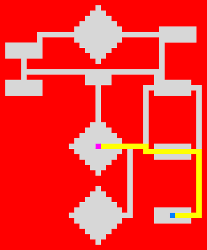
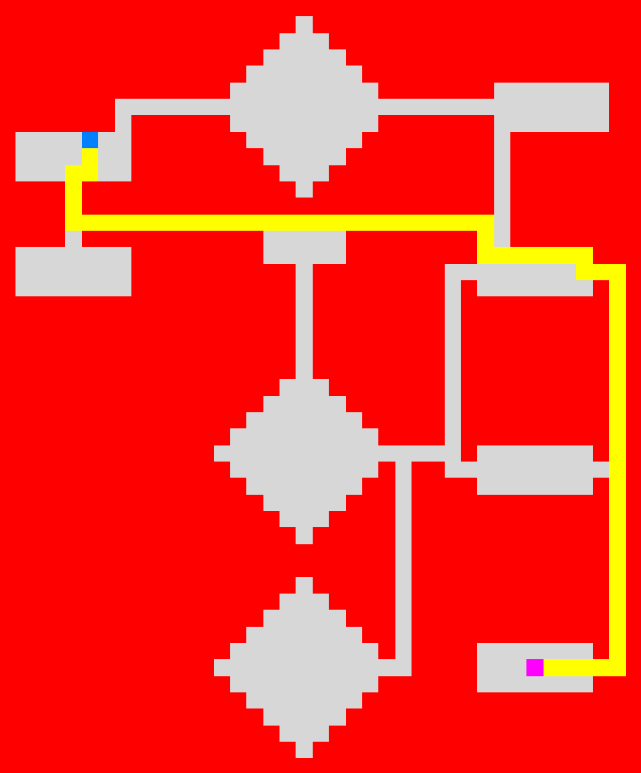
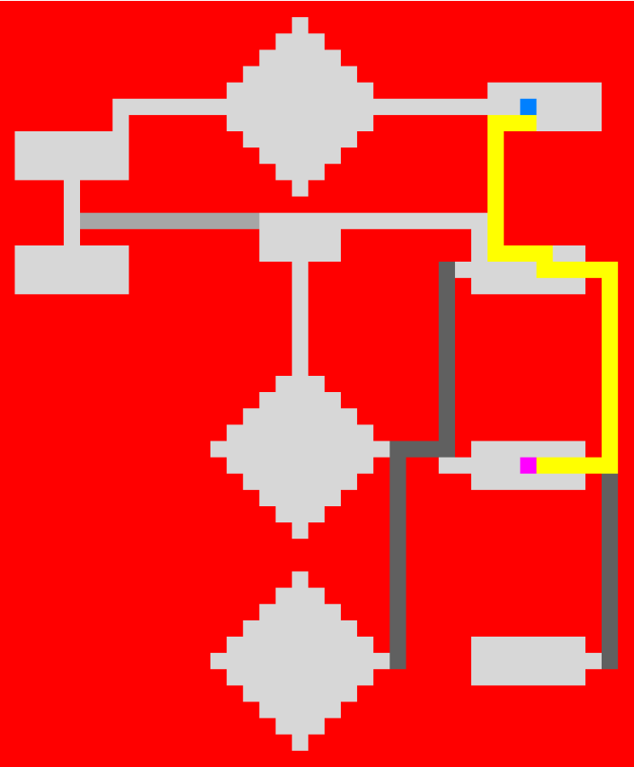
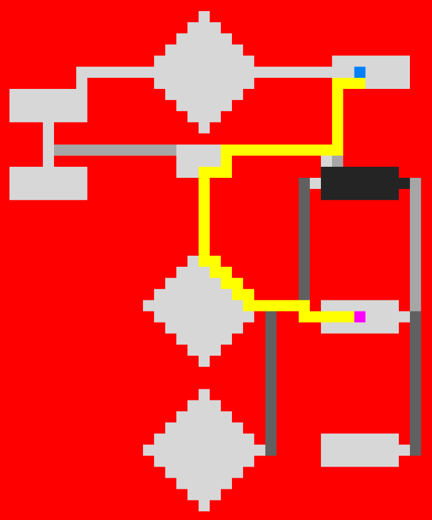

# Informed (heuristic) search algorithm: A*

Assignment from TDT4136 - Introduction to Artifical Intelligence.
The task was to find the shortest path towards a goal position, given a start position and a map including obstacles.
In Node.py, Map.py and search.py I have implemented the A* algorithm, using the Manhattan Distance as heuristics, in order to solve the task.

## Task 1

## Task 2

## Task 3

## Task 4

